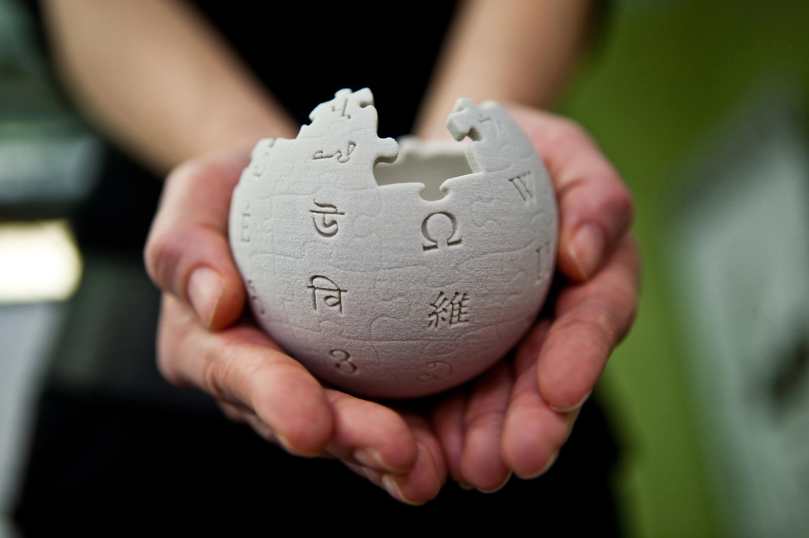

# Contributing to Wikipedia
Perhaps, my motivation to contribute to Wikipedia can be 
well summarised in the following motto of [wikimedia foundation]( https://wikimediafoundation.org/).

> Imagine el mundo en el que cada ser humano puede compartir libremente la suma de todo el conocimiento.

> Imagine a world in which every single human being can freely share in the sum of all knowledge.

## References
* https://www.wikipedia.org/
* https://wikimediafoundation.org/
* https://twitter.com/wikimedia
