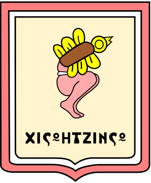

## Figure
Latest version  

*  Width=310 X Height=375 PIXELS

## Usage

* save images, create svg files
```
make
make viewpng
```
or 

```
eog png/drawing.png
inkscape svgpath/drawing.svg
```

## commons.wikimedia link

* https://commons.wikimedia.org/wiki/File:Escudo_de_Xicohtzinco.png
